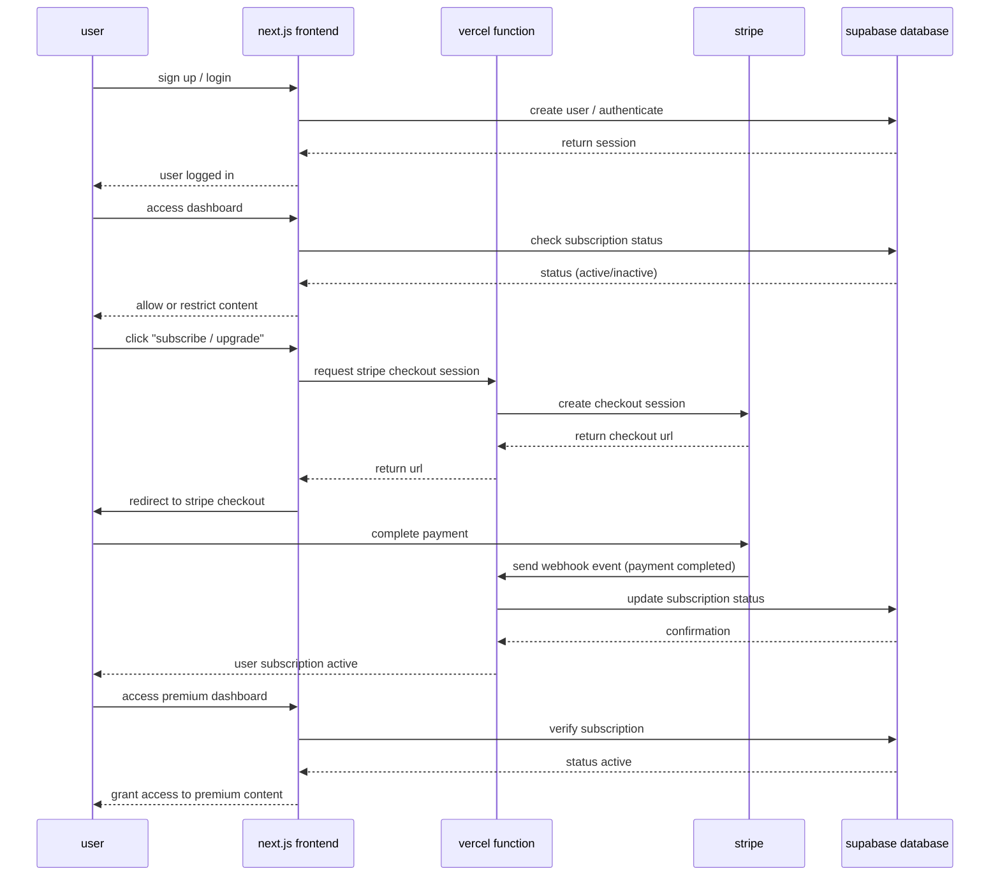

# subapp apresentation:

subapp is a SaaS platform built with **Next.js**, **React**, **Supabase**, **Vercel serverless functions**, and **Stripe payments**.  
that users can register, subscribe to plans, manage, and access premium content based on their subscription status.

---

## 🚀 technologies that i used

- frontend: next.js + react + tailwindcss
- backend: serverless api routes on vercel
- database & auth: supabase (postgresql + auth + storage)
- payments: stripe (checkout + webhooks)
- local dev environment: docker + docker compose]


## 📦 project structure

```text
/project
 ├── /pages
 │    ├── index.tsx          # Landing page
 │    ├── login.tsx          # Login page
 │    ├── register.tsx       # Registration page
 │    ├── dashboard.tsx      # Protected user dashboard
 │    └── /api
 │         ├── checkout.ts   # Stripe checkout session creation
 │         └── webhook.ts    # Stripe webhook to update subscription status
 ├── /components             # React components
 ├── /lib
 │    └── supabaseClient.ts  # Supabase client initialization
 └── docker-compose.yml      # Local development environment (Postgres + pgAdmin)
```

## 🏗 worflow explanation



explanation:

- step 1: user signs up or logs in via supabase auth.
- step 2: dashboard access is protected; backend checks subscription status.
- step 3: clicking “subscribe” triggers a vercel function to create a stripe checkout session.
- step 4: user completes payment in stripe.
- step 5: stripe sends a webhook; backend updates supabase subscription status.
- step 6: user can now access premium content if subscription is active.

## 🛠 local setup

1. clone the repository:

```bash
git clone https://github.com/mrlptrc/subapp.git
cd subapp
```

2. create .env.local with environment variables:
```bash
NEXT_PUBLIC_SUPABASE_URL=...
NEXT_PUBLIC_SUPABASE_ANON_KEY=...
SUPABASE_SERVICE_ROLE_KEY=...
STRIPE_SECRET_KEY=...
STRIPE_WEBHOOK_SECRET=...
```

3. start docker compose (postgres + pgadmin):
```bash
docker compose up -d
```

4. install dependencies and run next.js:
```bash
npm install
npm run dev
```

5. access:
- app: http://localhost:3000
- pgAdmin: http://localhost:8080
